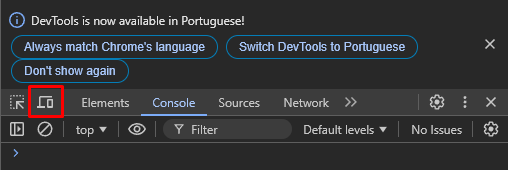
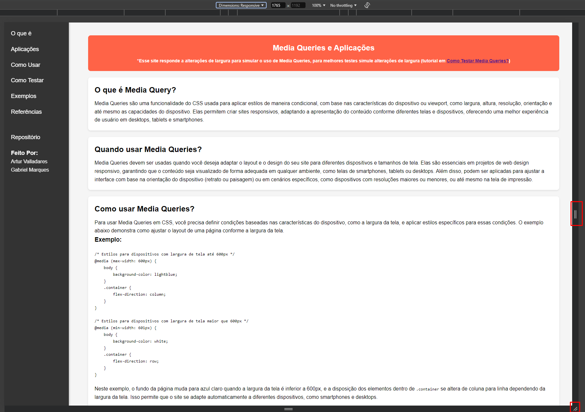
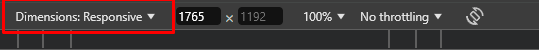
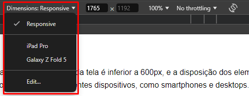
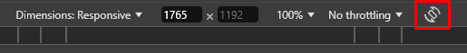
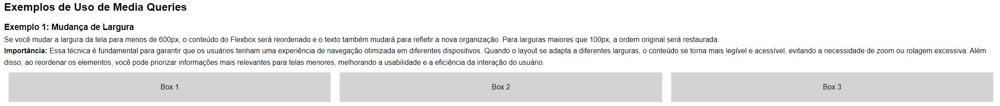
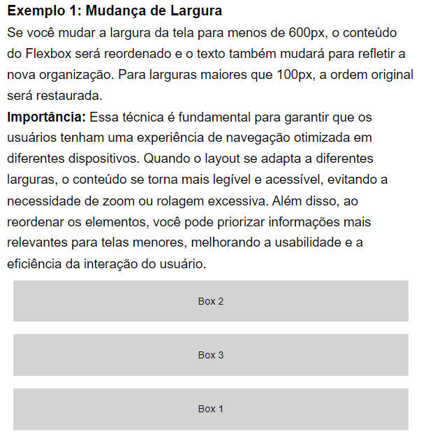
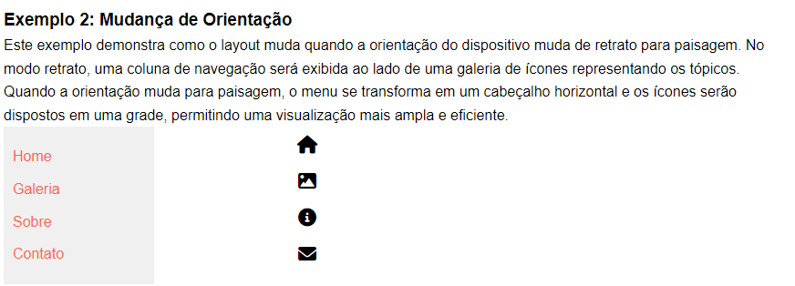
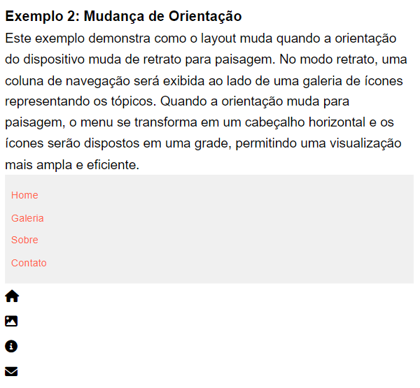
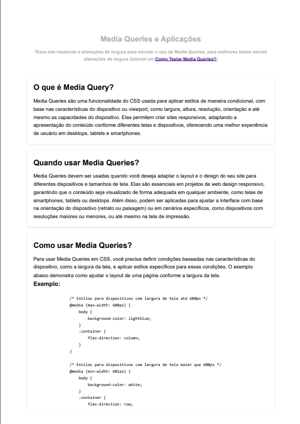

# Prova de Conceito: Media Queries

## Feito Por:
Artur Valladares Hernandez Giacummo - 10389053 <br>
Gabriel Marques Gonçalves Almeida - 10375711

## Como Executar o Código

Para acessar o site proposto por esta prova de conceito (POC), você tem duas opções:

### Opção 1: Acesso Online

Você pode visualizar o projeto diretamente no navegador acessando o seguinte link:
[**https://arturstaation.github.io/POC_MediaQuery/**](https://arturstaation.github.io/POC_MediaQuery/)

### Opção 2: Acesso Local

Se preferir trabalhar com uma cópia local do projeto, siga os passos abaixo:

1. **Baixar o Projeto**
   - Acesse o repositório do projeto e clique em **"Código"**.
   - Selecione a opção **"Baixar ZIP"** para obter o arquivo compactado do projeto.

2. **Descompactar o Arquivo**
   - Após o download, localize o arquivo ZIP em seu computador.
   - Descompacte o arquivo para uma pasta de sua escolha.

3. **Abrir o Arquivo HTML**
   - Navegue até a pasta descompactada.
   - Abra o arquivo `index.html` em um navegador web de sua preferência (como Google Chrome, Mozilla Firefox, etc.).

Com esses passos, você poderá visualizar e interagir com a prova de conceito localmente em seu computador.

Se precisar de ajuda adicional ou encontrar algum problema, sinta-se à vontade para entrar em contato!

## Visão Geral

Este projeto é uma Prova de Conceito (POC) que demonstra a utilização de Media Queries no CSS para criar layouts responsivos. O objetivo desta POC é mostrar como diferentes estilos podem ser aplicados com base em condições específicas, como a largura da tela e a resolução do dispositivo, permitindo uma melhor experiência do usuário em diversos dispositivos.

## Estrutura do Projeto

O projeto é dividido em várias seções, cada uma abordando um aspecto importante das Media Queries. Abaixo, você encontrará uma descrição de cada seção e seu conteúdo correspondente.

### 1. O que é Media Query?

Nesta seção, abordamos o que são Media Queries.
Media Queries são uma funcionalidade do CSS usada para aplicar estilos de maneira condicional, com base nas características do dispositivo ou viewport, como largura, altura, resolução, orientação e até mesmo as capacidades do dispositivo. Elas permitem criar sites responsivos, adaptando a apresentação do conteúdo conforme diferentes telas e dispositivos, oferecendo uma melhor experiência de usuário em desktops, tablets e smartphones.

### 2. Quando usar Media Queries?

Aqui, discutimos as aplicações práticas das Media Queries.
Media Queries devem ser usadas quando você deseja adaptar o layout e o design do seu site para diferentes dispositivos e tamanhos de tela. Elas são essenciais em projetos de web design responsivo, garantindo que o conteúdo seja visualizado de forma adequada em qualquer ambiente, como telas de smartphones, tablets ou desktops. Além disso, podem ser aplicadas para ajustar a interface com base na orientação do dispositivo (retrato ou paisagem) ou em cenários específicos, como dispositivos com resoluções maiores ou menores, ou até mesmo na tela de impressão.

### 3. Como usar Media Queries?

Nesta seção, explicamos como implementar Media Queries em CSS.
Para usar Media Queries em CSS, você precisa definir condições baseadas nas características do dispositivo, como a largura da tela, e aplicar estilos específicos para essas condições. O exemplo abaixo demonstra como ajustar o layout de uma página conforme a largura da tela.

```css
/* Estilos padrão */
body {
    background-color: white;
}

/* Media Query para telas pequenas */
@media (max-width: 600px) {
    body {
        background-color: lightblue;
    }
}

/* Media Query para telas médias */
@media (min-width: 601px) and (max-width: 1024px) {
    body {
        background-color: lightgreen;
    }
}

/* Media Query para telas grandes */
@media (min-width: 1025px) {
    body {
        background-color: lightcoral;
    }
}
```

### 4. Como Testar Media Queries?

Aqui, fornecemos um guia passo a passo sobre como testar Media Queries usando as Ferramentas do Desenvolvedor do navegador. As instruções incluem como inspecionar elementos, simular diferentes tamanhos de tela e testar diferentes orientações de dispositivos, permitindo que você veja como as Media Queries respondem em tempo real.

Para testar as Media Queries, siga estas etapas:

1. **Abra as Ferramentas do Desenvolvedor**:
   - Clique com o botão direito em qualquer parte da página e selecione "Inspecionar" ou use o atalho `Ctrl + Shift + I` (Windows) ou `Cmd + Option + I` (Mac).

2. **Ative a Visualização Responsiva**:
   - Na janela de Ferramentas do Desenvolvedor, clique no ícone de dispositivo móvel ou use o atalho `Ctrl + Shift + M` (Windows) ou `Cmd + Shift + M` (Mac).

     
   *Imagem 1*

3. **Selecione o Tamanho da Tela**:
   - No topo da janela, você verá um menu para escolher diferentes dispositivos ou inserir larguras de tela personalizadas, ou alterar nas três barrinhas.

     
   *Imagem 2*  

     
   *Imagem 3*

4. **Teste Diferentes Tamanhos de Tela**:
   - Altere entre diferentes tamanhos de tela para verificar como as Media Queries respondem.

### Bônus

#### Como testar diferentes dispositivos

1. **Abra as Ferramentas do Desenvolvedor**:
   - Clique com o botão direito em qualquer parte da página e selecione "Inspecionar" ou use o atalho `Ctrl + Shift + I` (Windows) ou `Cmd + Option + I` (Mac).

2. **Ative a Visualização Responsiva**:
   - Na janela de Ferramentas do Desenvolvedor, clique no ícone de dispositivo móvel ou use o atalho `Ctrl + Shift + M` (Windows) ou `Cmd + Shift + M` (Mac).

3. **Selecione Dispositivos Predefinidos**:
   - No topo do painel, você poderá selecionar diferentes dispositivos predefinidos ou personalizar a largura e a altura do viewport manualmente.

     
   *Imagem 4*

4. **Teste com Diferentes Dispositivos**:
   - Selecione dispositivos como smartphones, tablets e desktops para verificar como o layout responde às diferentes larguras de tela.

     
   *Imagem 5*

#### Como testar diferentes orientações

1. **Ative o Modo de Dispositivos Móveis**:
   - Com as Ferramentas do Desenvolvedor abertas e o modo de dispositivos móveis ativado, localize o ícone de alternância de orientação.

     
   *Imagem 6*

2. **Alterne entre Orientações**:
   - Clique neste ícone para alternar entre as orientações "retrato" e "paisagem". Isso simulará a rotação do dispositivo, permitindo que você veja como o layout da página se adapta.


### 5. Exemplos de Uso de Media Queries

Esta seção apresenta exemplos práticos de como as Media Queries podem ser aplicadas. Os exemplos ilustram mudanças de largura e de orientação, mostrando como o layout pode se adaptar dinamicamente a diferentes condições. Esta seção é fundamental para entender como implementar as Media Queries em situações reais.

### Exemplo 1: Mudança de Largura

Se você mudar a largura da tela para menos de 600px, o conteúdo do Flexbox será reordenado e mostrado em coluna. Para larguras maiores que 1000px, a ordem original será restaurada e mostrada em linha.

**Importância:** Essa técnica é fundamental para garantir que os usuários tenham uma experiência de navegação otimizada em diferentes dispositivos. Quando o layout se adapta a diferentes larguras, o conteúdo se torna mais legível e acessível, evitando a necessidade de zoom ou rolagem excessiva. Além disso, ao reordenar os elementos, você pode priorizar informações mais relevantes para telas menores, melhorando a usabilidade e a eficiência da interação do usuário.

#### Resultados:
##### Dispositivos com mais de 1000px de largura:

##### Dispositivos com menos de 1000px de largura:


### Exemplo 2: Mudança de Orientação

Este exemplo demonstra como o layout muda quando a orientação do dispositivo muda de retrato para paisagem. No modo retrato, uma coluna de navegação será exibida ao lado de uma galeria de ícones representando os tópicos. Quando a orientação muda para paisagem, o menu se transforma em um cabeçalho horizontal e os ícones serão dispostos em uma grade, permitindo uma visualização mais ampla e eficiente.

**Importância:** A capacidade de um layout se adaptar à mudança de orientação é fundamental na experiência do usuário em dispositivos móveis. A mudança de orientação, seja de retrato para paisagem ou vice-versa, pode impactar significativamente como o conteúdo é apresentado. Layouts responsivos que se ajustam automaticamente garantem que os usuários tenham uma visualização otimizada, independentemente da orientação do dispositivo. Isso melhora a usabilidade, permitindo que os usuários acessem as informações de maneira mais eficiente e intuitiva.

#### Resultados:
##### Dispositivos no modo paisagem:

##### Dispositivos no modo retrato:


### Exemplo 3: Estilos para Impressão

Ao tentar imprimir esta página, o header será oculto automaticamente para otimizar o conteúdo impresso.

**Importância:** Isso pode ser útil para remover elementos visuais não necessários na impressão.

#### Resultado:


### 6. Referências

Por fim, incluímos uma lista de referências úteis para aprender mais sobre Media Queries e design responsivo. Essas referências incluem links para documentações e tutoriais que podem ajudar a aprofundar seus conhecimentos no assunto.

